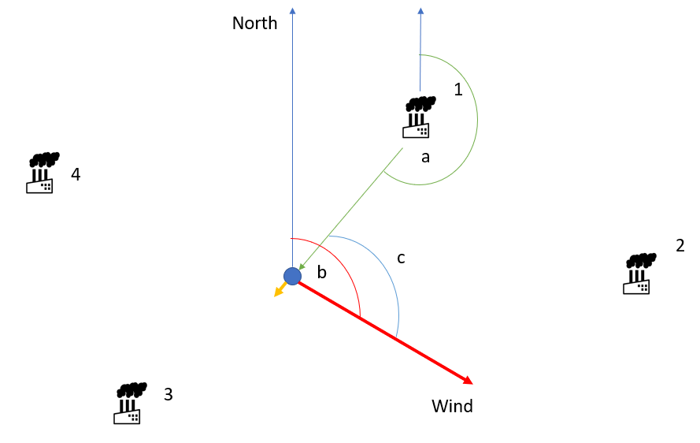

# Introduction

Natural gas has been introduced as an alternative to coal to be used as fuel in the industry. Based on recent research in Canada and U.S methane leakage is the most potent polluter which leaks in big cities and factories. This amount of leaking made methane a critical problem in terms of environmental preservation even more than coal burning. Based on the recently published report in [Canada Environmental Defence](https://environmentaldefence.ca/report/canadas-methane-gas-problem/) methane emissions from Canada’s oil and gas sector – due to both venting of methane as part of normal operation, and leaks from equipment – are higher than previously thought. One solution is to develop a simulator which helps decision-makers to see the effects of methane leakage on every location in geographic space. The main objective of this repo is to develop a simulator to predict the methane distribution in the environment when leaking source locations are known.

## Capabilities and methods

The developed simulator is capable of simulate methane leaking values for static stations and trajectories when you have leaking source pre-generated time series of methane. In case leaking source dataset is not available, you can use leaking source simulator to generate methane values. To calcualte methane values for static sensors or trajectories, the simulator uses interpolation functions.

The simulator can send measurements in STA format to a STA endpoint in a rate that you specify in settings.

If you want to add wind direction and speed in your simulation conditions you can activate wind in the simulator settings. Then you can apply it in your simulation. The following is a summary of how the simulator take wind into consideration in simulation process. The following Figure illustrates how we will consider wind in the methane values interpolation.



In Figure, blie circle is the target station that we are going to simulate methane values for it based on distance to four leaking sources and wind direction. The red arrow is the wind direction, green arrow is the direction from leaking source 1 to the target station, blue arrow is the north direction, and orange arrow is the projection of wind on green arrow. The `a` is the azimuth of green arrow direction, `b` is azimuth of wind and `c` is the angle between leaking source-target direction and wind direction. To interpolate methane values when there is not any wind, we only consider distance between target and leaking sources. When we add wind, we have to apply wind direction and speed into interpolation values. The following steps should be taken to calcualte final target values.
1- Calculate angle between wind and leak-target direction
2- Eliminate leaking sources which have angel more than 180 degree with wind.
3- Run interpolation based on distance between leaking sources and the target.
4- Calculate projection of wind speed on leak-target directions
5- Run interpolation based on projected wind speed values
6- Averaging of the step 3 and step 5 results will give the final interpolated value for target station.

## Installing Requirements

The simulator has been developed in python 3. Therefore, in the beginning, you might need to install python3. Before running the simulator you need to install the following packages.

```terminal
pip3 install schedule
pip3 install geojson
pip3 install requests
pip3 install utm
```

## Input requirements

The simulator supports both csv and json file formats as inputs. However, you must have the following columns (if you use csv file) or keys (if you use json file).

`Time` : The time of measurements.
`CH4` : The value of measured methane.
`ID` : ID of leaking source or target station.
`Longitude` : The longtude of the leaking source, target station, or trajectory.
`Latitude` : The latitude of the leaking source, target station, or trajectory.

**Note** If you are not going to use leaking source time series data, you don't need `Time` and `CH4` attributes.

**Note** The input json files must follow [geojson](https://datatracker.ietf.org/wg/geojson/charter/) standard formats.

**Note** The input csv files must be comma dellimeter.

## Configurations

Before running the simulator, you need to set up the configurations and settings you want for your scenario. There are four config files which are as follows:

### General configuration

This configuration is mandatory and common for all simulation scenarios. To set up the general configuration you can edit the `config.json` file. The following guide you to modify the file.

```json
{
    "post_rate": 2, // The time interval to posting simulation results to your endpoint. Unit is seceond and datatype is positive integer
    "sampling_rate":2, // The time interval to resample simulation results when you have leaking source temporal results. Unit is seceond and datatype is positive integer
    "simulation_method": "IDW_planar", // The interpolation model for your simulation. The values should be : IDW_planar
    "use_case" : "known_static", // The use case or scenario you are going to simulate the values should be: known_static|knwon_trajectory|random_static. Based on your choice here one of other configs will be epmloyed for the simulation
    "STA": // This branch determines settings of STA endpoints
    {
        "STA_endpoint": "", // STA Endpoint URL should be string.
        "user_name": "", // Username of the endpoint in Basic authorization settings. It is string.
        "password": "" // Password of the endpoint in Basic authorization settings. It is string.
    }
    ,
    "wind": // This branch determines settings in case you want to involve wind model in the simulation
    {
        "wind_activated": true, // Determines if the user wants to use wind in simulation or not. values are true or false
        "wind_direction": 0,  //The direction of wind blowing in your simulation area
        "wind_direction_UofM": "deg", // The unit of wind direction. Now it only reads deg.
        "wind_speed": 70, // The speed of wind blowing in your simulation area
        "wind_speed_UofM": "km/h" // The unit of wind speed. Now it only reads km/h.
    }
}

```

### known static configuration

It is the settings you need to apply if you have time series methane values of your leaking sources and the location of your targets are static (static stations). To set up the known static you can edit the `known_static.json` file. The following guide you to modify the file.

```json
{
    "known_station": "leaking.json", // The address of leaking source time series in json or csv formats.
    "unknown_station":"sensors.json" // The address of target stations in json or csv formats.
}
```

### known trajectory configuration

It is the settings you need to apply if you have time series methane values of your leaking sources and your target is a moving vehicle. To set up the known trajectory you can edit the `known_trajectory.json` file. The following guide you to modify the file.

```json
{
    "known_station": "", // The address of leaking source time series in json or csv formats
    "trajectory":"" // The address of trajectory of a vehicle time series in json or csv formats
}
```

### random static configuration

It is the settings you need to apply if you don't have time series methane values of your leaking sources and the location of your targets are static (static stations). Therefore, in this case leaking source values are generated by the simulator. To set up the random static you can edit the `random_static.json` file. The following guide you to modify the file.

```json
{
    "known_station":"", // The address of leaking source time series in json or csv formats.
    "unknown_station":"", // The address of target stations in json or csv formats.
    "leak_simulator" : { // The simulator settings for leaking sources
        "method": "random_walk", // The simultation of methane values nethod. Now the soppurted values are: random_walk
        "random_walk":[{ // If random walk is selected, the following setting should be applied. You might have an array of leaking sources.
            "ID":"1", // The ID of leaknig source in the known_station file
            "range" :[2,4], // The expected range for methene simulation for this station. Type is a 1x2 array of numbers.
            "step":0.5 // The step parameter for methane values. The type is number.
        },{
            "ID":"2",
            "range" :[1,5],
            "step":0.2
        }]
    }
}
```

## Run

To run the application go to the repo directory and run the following code in your terminal.

`python3 simulate_methane.py`
